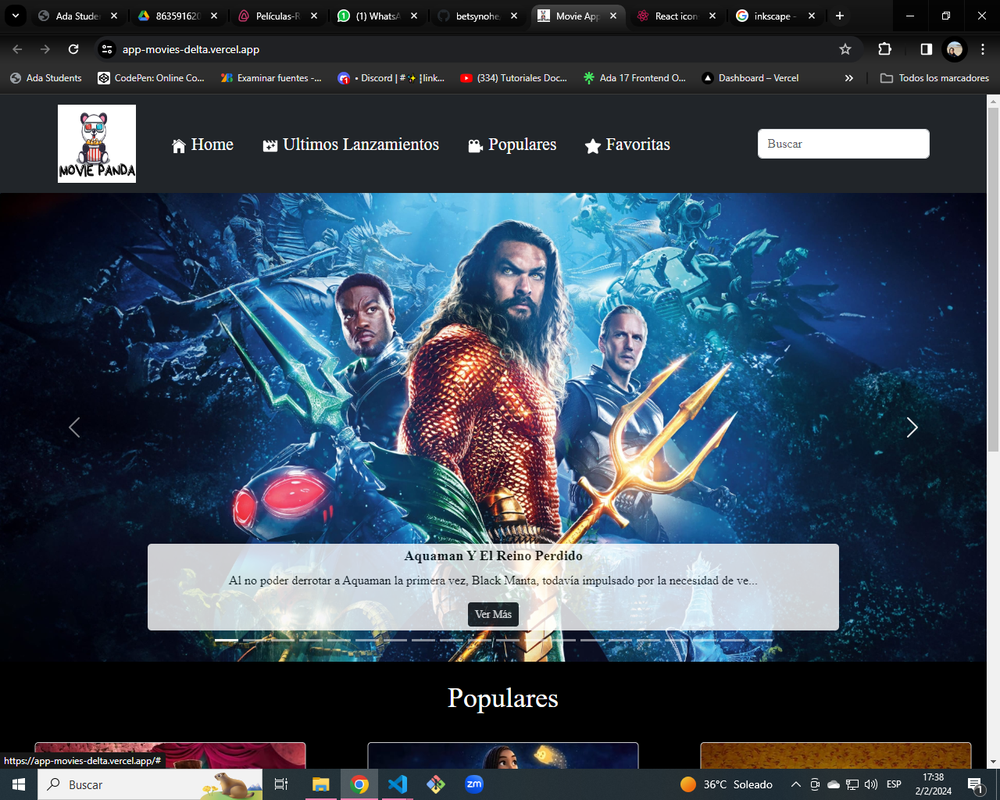
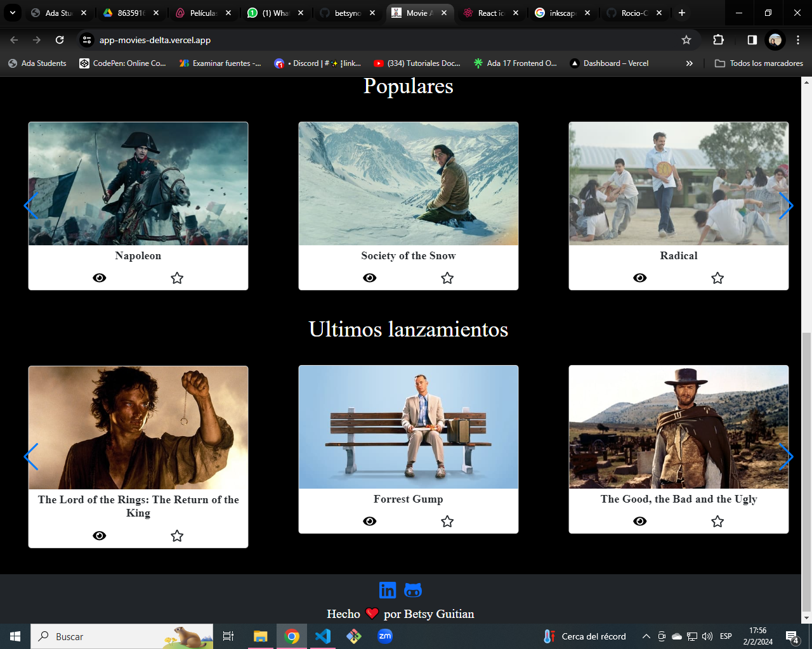
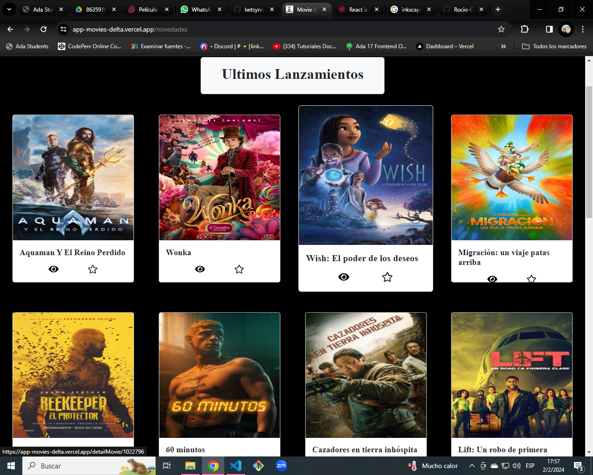
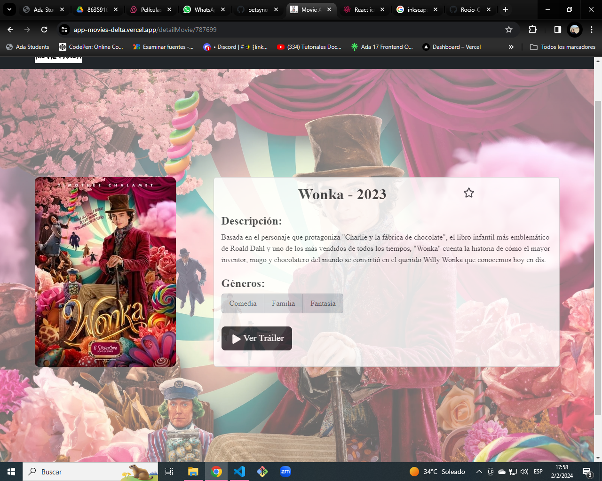
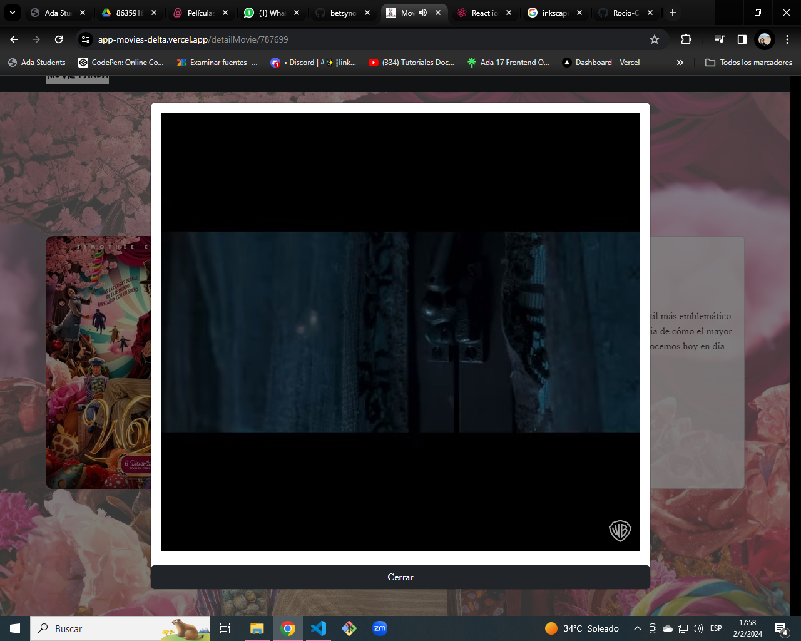
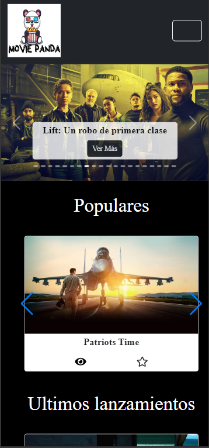

# Movie app

este es el proyecto final de la carrera de Developer Font end dictada por ADA ITW.

Esta app está realizada con React (JavaScript) con Vite mas una combinacion de varios frameworks de estilo como son react Boostrap, Swiper, react Youtube.

El proyecto puede verse en este enlace [link](https://app-movies-delta.vercel.app/).

  

 ## Es una aplicación para buscar peliculas.
 

Podrás buscar peliculas, ver las tendencias y las ultimas que han salido, puedes leer los detalles de la misma e incluso ver el trailer si esta disponible.<em> Tenés disponible una seccion donde podras marcar tus pelis favoritas.</em>

 

  ## Home
 

## Últimos Lanzamientos

 

## Detalles

 

## Ver Trailer

## vista para celular

La app es completamente responsive y se puede visualizar en cualquier dispositivo.

 

## _Contacto_
Acá mis Redes Sociales, si queres contactarme:
* <a href="http://wa.me/541134277653">Whatsapp</a>
* <a href="http://github.com/betsynohe">Github</a>
* <a href="http://www.linkedin.com/in/betsy-guitian-b36b06242/">Linkedin</a>
* <a href="mailto:betsyguitian@gmail.com">E-mail</a>
